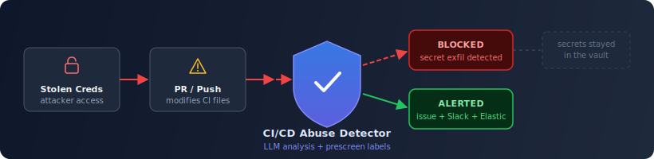
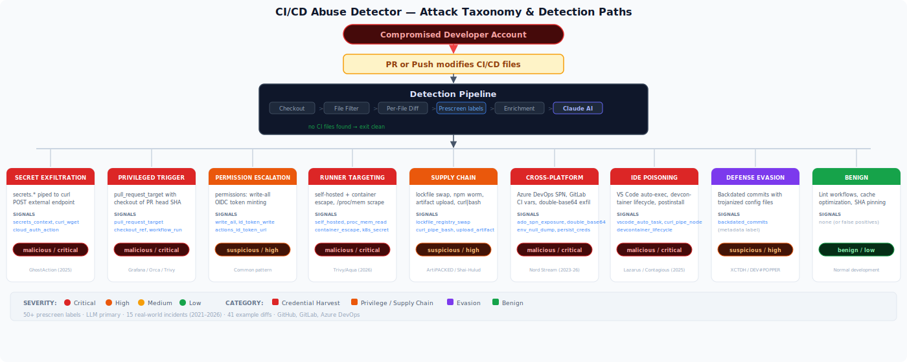

# CI/CD Abuse Detector

[](LICENSE)
[](docs/parity.md)
[](https://docs.anthropic.com/en/docs/claude-code)
[](#how-it-works)

Drop-in CI templates that use an LLM to detect suspicious changes to CI/CD pipelines, workflows, and automation configurations. Built to catch a common attack chain: **stolen developer credentials → modified workflow → harvested CI secrets**.

**This repository is a prototype and reference implementation** tied to Elastic Security Labs research: [Detecting CI/CD pipeline abuse with LLM-augmented analysis](https://www.elastic.co/security-labs/detecting-cicd-pipeline-abuse-with-llm-augmented-analysis). It is **not** an officially supported Elastic product. Use, fork, and adapt the templates for your own review process; do not expect product-style SLAs, support entitlements, or a fixed roadmap from Elastic.



### How to use this GitHub project

| If you are… | Do this |
|-------------|---------|
| **Using the detector in your pipelines** | Copy the files from [Quick start](#quick-start) into your repository, or **fork** this repo and maintain your own copy. Edit the workflow YAML, prompt, or schema in your repo or fork so it matches your environment and review process. |
| **Reporting a security vulnerability** | Use [SECURITY.md](SECURITY.md) and [Elastic’s disclosure process](https://www.elastic.co/community/security) for undisclosed vulnerabilities (avoid public issues until they are fixed). |

**Contributing:** Most teams customize by **forking** and changing `templates/`, `prompts/`, and `schemas/` in their org. If you want to propose a change *to this repository*, see [CONTRIBUTING.md](CONTRIBUTING.md) and [CODEOWNERS](CODEOWNERS)—upstream scope and review capacity are limited, so not every change will be a good fit here.

| File | Purpose |
|------|---------|
| [LICENSE](LICENSE) | Apache License 2.0 |
| [NOTICE.txt](NOTICE.txt) | Copyright / attribution |
| [CONTRIBUTING.md](CONTRIBUTING.md) | Forking, security reporting, and upstream pull requests |
| [SECURITY.md](SECURITY.md) | Vulnerability reporting |
| [CODE_OF_CONDUCT.md](CODE_OF_CONDUCT.md) | Community standards |
| [CODEOWNERS](CODEOWNERS) | Code review routing (Elastic) |
| [catalog-info.yaml](catalog-info.yaml) | Optional [Backstage](https://backstage.io/)-style catalog metadata; not required to use the templates |

The `rules/` directory is **not** part of what you copy into a consumer repo. [Scoring Notes](rules/scoring-notes.md) (also linked under [Documentation](#documentation)) is **optional** reading: it explains how prescreen labels are combined and tuned. You can remove or ignore it if you only care about running the workflow from `templates/`, `prompts/`, and `schemas/`.

## Quick Start

### 1. Copy files into your repository

```
templates/github/pr-cicd-abuse-detector.yml → .github/workflows/pr-cicd-abuse-detector.yml
prompts/analyze-cicd-change.md              → prompts/analyze-cicd-change.md
schemas/verdict.schema.json                 → schemas/verdict.schema.json
```

### 2. Add repository secrets

**LLM authentication (pick one):**

| Secret | Notes |
|--------|-------|
| `ANTHROPIC_API_KEY` | Standard Anthropic API key |

Or, for Foundry (enterprise):

| Secret | Notes |
|--------|-------|
| `ANTHROPIC_FOUNDRY_BASE_URL` | Foundry endpoint URL |
| `ANTHROPIC_FOUNDRY_API_KEY` | Foundry API key |

**Optional integrations:**

| Secret | Notes |
|--------|-------|
| `SLACK_WEBHOOK_URL` | Slack incoming webhook for alert notifications |
| `ES_URL` | Elasticsearch endpoint for verdict shipping (e.g. `https://<deployment>.elastic.cloud`) |
| `ES_API_KEY` | Elasticsearch API key (base64-encoded) for verdict shipping |
| `GITLAB_ISSUE_TOKEN` | GitLab only — token with `api` scope for issue creation (see [GitLab setup](docs/gitlab.md)) |

### 3. Optionally configure variables

| Variable | Default | Description |
|----------|---------|-------------|
| `CI_CD_ABUSE_ALERT_THRESHOLD` | `high` | Minimum severity for alerts (low/medium/high/critical) |
| `CI_CD_ABUSE_FAIL_ON_SEVERITY` | _(empty — disabled)_ | Fail the PR/pipeline at this severity or above (`low`/`medium`/`high`/`critical`). When empty (default), the detector alerts only and never blocks merges. |
| `CI_CD_ABUSE_INCLUDE_PUSHES` | `true` | Analyze direct pushes to main/master |
| `CI_CD_ABUSE_EXTRA_PATHS` | _(empty)_ | Comma-separated path fragments so non-default layouts still trigger analysis ([details](docs/github.md#extra-path-patterns)) |

### 4. Done

Open a PR that touches a workflow file and watch it run.

## How It Works

For a **visual pipeline overview**, see [`docs/architecture.svg`](docs/architecture.svg). For narrative, design choices, and the self-security model, read [Architecture](docs/architecture.md).

1. **Filter** — Changed files are matched against CI/CD, build, release, and packaging paths.
2. **Per-file diff** — Each file is diffed individually and capped at 10k chars, reducing bypass via large benign padding.
3. **Prescreen enrichment** — Regex- and metadata-derived **labels** add context for the model; the LLM still analyzes the full diff.
4. **LLM analysis** — Claude analyzes the diffs against a credential-harvesting-focused threat model.
5. **Alert** — Step summary, optional issues, Slack, and optional Elasticsearch verdict shipping when severity meets threshold.
6. **Fail gate** — Optionally block the PR when severity exceeds a configured threshold.

**In the templates themselves**, pre-processing is **bash + jq + grep**. The only tool installed in CI for analysis is the Claude Code CLI (via Node). There is **no** Python in the *runtime* path for the published workflows.

## Documentation

| Doc | Description |
|-----|-------------|
| [Architecture](docs/architecture.md) | Pipeline flow ([diagram](docs/architecture.svg)), design decisions, self-security model |
| [Threat Model](docs/threat-model.md) | Threat categories, real-world incidents, coverage, limitations |
| [GitHub Setup](docs/github.md) | GitHub Actions configuration, permissions, troubleshooting |
| [GitLab Setup](docs/gitlab.md) | GitLab CI configuration, variables, caveats |
| [Azure DevOps Setup](docs/azure-devops.md) | Azure Pipelines configuration, variables, caveats |
| [AI-assisted setup](docs/ai-setup.md) | CLI auth and agent-driven install/testing on each platform |
| [Alerting](docs/alerting.md) | Slack, issues/work items, optional Elastic verdict shipping |
| [Elastic queries](docs/elastic-queries.md) | ES|QL examples for shipped verdicts (`logs-cicd.abuse-*`) |
| [Cross-Platform Parity](docs/parity.md) | Feature matrix across GitHub, GitLab, Azure DevOps |
| [Scoring Notes](rules/scoring-notes.md) | Prescreen label combinations, calibration |
| [Testing](docs/testing.md) | `make test`, `make validate`, optional LLM test notes |

## Reference templates (by platform)

| Platform | Coverage | Template |
|----------|----------|----------|
| GitHub Actions | Reference workflow and prescreen + LLM step | [`templates/github/pr-cicd-abuse-detector.yml`](templates/github/pr-cicd-abuse-detector.yml) |
| GitLab CI | Reference job script (parity with GitHub) | [`templates/gitlab/pr-cicd-abuse-detector.yml`](templates/gitlab/pr-cicd-abuse-detector.yml) |
| Azure DevOps | Reference pipeline (parity with GitHub) | [`templates/azure-devops/pr-cicd-abuse-detector.yml`](templates/azure-devops/pr-cicd-abuse-detector.yml) |

## Attack Taxonomy



See the [Threat Model](docs/threat-model.md) for coverage of each attack path.

## Maintainer: validate and single-file build

This repository includes a **Makefile** and `scripts/build-embed.py` for **development only** (not required for consumers). Install the small **PyYAML** dependency: `pip install -r requirements.txt`, then:

```bash
make validate
make test
make build
# → dist/pr-cicd-abuse-detector.yml (single-file GitHub workflow)
```

## License

[Apache License 2.0](LICENSE)

See [NOTICE.txt](NOTICE.txt).
