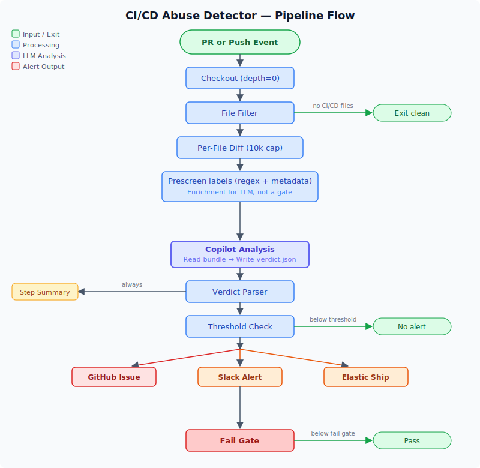

# Architecture

The CI/CD Abuse Detector is a CI workflow template (GitHub Actions, GitLab CI, and Azure DevOps Pipelines) that uses an LLM to analyze changes to CI/CD, build, release, and packaging files for signs of abuse.

## Pipeline Flow

## Key Design Decisions

### Per-File Diff Processing

A global `head -c 30000` is a bypass vector: an attacker adds a large benign Dockerfile change (25k chars) plus a small malicious workflow change (2k chars), and the malicious change gets truncated. Per-file caps (10k each) ensure every file is represented in the analysis.

### Prescreen enrichment (regex + metadata)

The workflow attaches **prescreen labels** to the analysis bundle: regex-derived hints (common abuse shapes) plus **metadata** (first-time contributor, non-org member, backdated commits). These are **enrichment for the LLM**, not an IOC list and not a substitute for reading the diff. They are **incomplete by design** — any fixed pattern can be evaded — so the product does not rely on “signal coverage” alone.

Copilot **always** receives and analyzes the diffs, even when no prescreen labels fire, so novel attacks still get a full review. Labels help focus attention and calibrate confidence. Which files enter analysis depends on the path filter in the template; teams can extend it with `CI_CD_ABUSE_EXTRA_PATHS` (see [GitHub setup](github.md)).

### Copilot via Copilot CLI

The workflow calls Copilot CLI directly in non-interactive mode and validates responses with `jq`. This provides:
- Provider-neutral API-based model access
- Strict JSON response handling before downstream processing
- Simple secret management via a single `COPILOT_GITHUB_TOKEN`
- Consistent behavior across GitHub, GitLab, and Azure DevOps templates

### Shell Injection Prevention

All GitHub context expressions and LLM-derived outputs are passed through `env:` mappings, never interpolated directly in `run:` blocks via `${{ }}`. This prevents shell injection even if the model is prompt-injected into writing malicious content in the verdict.

### Workflow Self-Security

The detector itself holds secrets (`COPILOT_GITHUB_TOKEN`, `SLACK_WEBHOOK_URL`, `GITHUB_TOKEN`). It is designed to be safe by default:

| Risk | Mitigation |
|------|------------|
| Attacker-controlled PR accesses secrets | Uses `pull_request` (not `pull_request_target`) — fork PRs don't get secrets |
| Attacker modifies the workflow in their PR | Fork PRs don't get access to repo secrets; the attacker's modified workflow runs without credentials |
| Attacker modifies the analysis prompt or schema in their PR | Prompt and schema are read from the **base branch** via `git show $BASE_SHA:path`, not from the working tree. Even if the attacker neuters the prompt, the trusted version is used. A `prompt_file_modified` signal fires to alert on this. |
| Secrets exposed to all steps | Copilot CLI credentials are step-scoped on the Copilot analysis step; `SLACK_WEBHOOK_URL` and `GH_TOKEN` are step-scoped to their respective steps |
| Model output leaks secrets | Verdict JSON is validated before use and never executed as code |
| LLM output used in shell injection | All verdict outputs pass through `env:` mappings, never `${{ }}` in `run:` |
| Workflow permissions too broad | Minimal: `contents: read`, `pull-requests: read`, `issues: write` |

**Limitation:** Direct pushes run the pushed workflow version — this is inherent to git-triggered CI. The detector cannot protect against an attacker who already has direct push access to the workflow file.
